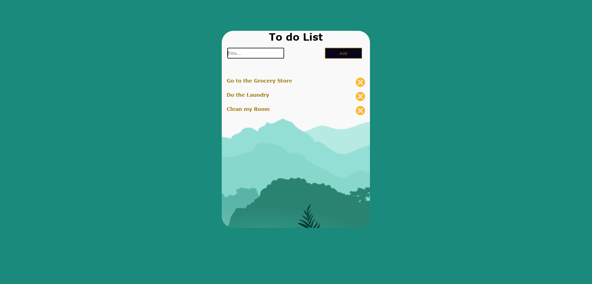

## What is a todo list?

A todo list is a list of tasks that you need to complete. It can be used to keep track of your tasks, prioritize them, and make sure that you don't forget anything.

## Why use a todo list?

There are many reasons to use a todo list. Here are a few:

* To keep track of your tasks.
* To prioritize your tasks.
* To make sure that you don't forget anything.
* To help you stay organized.
* To boost your productivity.

## How to create a todo list

There are many ways to create a todo list. Here are a few:

* Use a pen and paper.
* Use a computer or mobile app.
* Use a voice-activated assistant.

## How to use a todo list

Once you have created your todo list, you can use it to keep track of your tasks. Here are a few tips:

* Add tasks as you think of them.
* Prioritize your tasks.
* Mark tasks as complete as you finish them.
* Review your todo list regularly.

## Benefits of using a todo list

There are many benefits to using a todo list. Here are a few:

* You can stay organized.
* You can prioritize your tasks.
* You can make sure that you don't forget anything.
* You can boost your productivity.        
